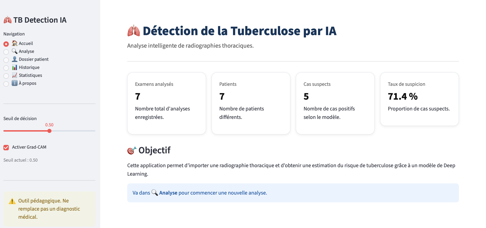
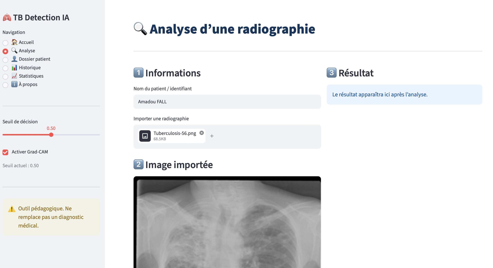
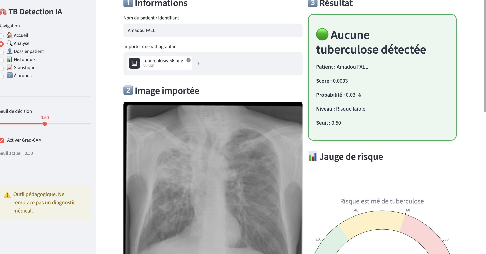
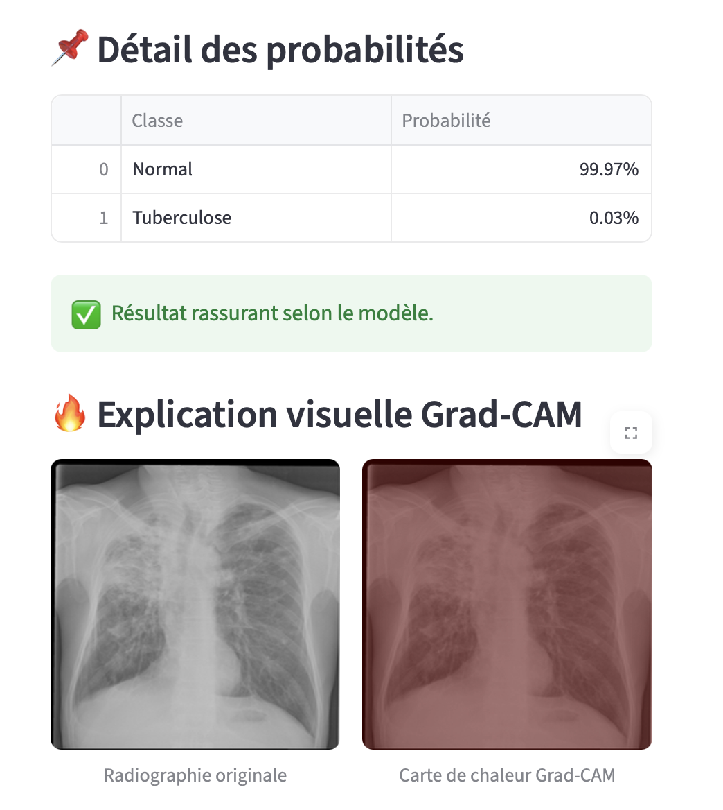
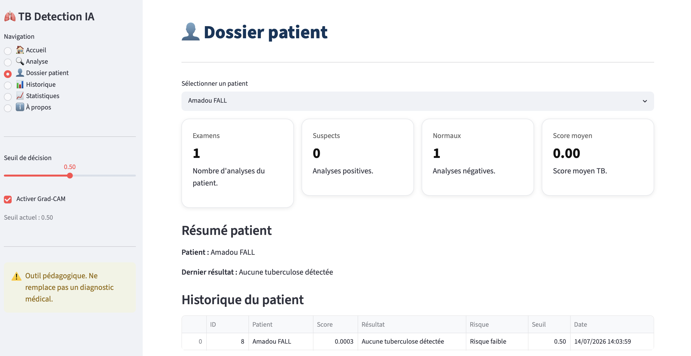
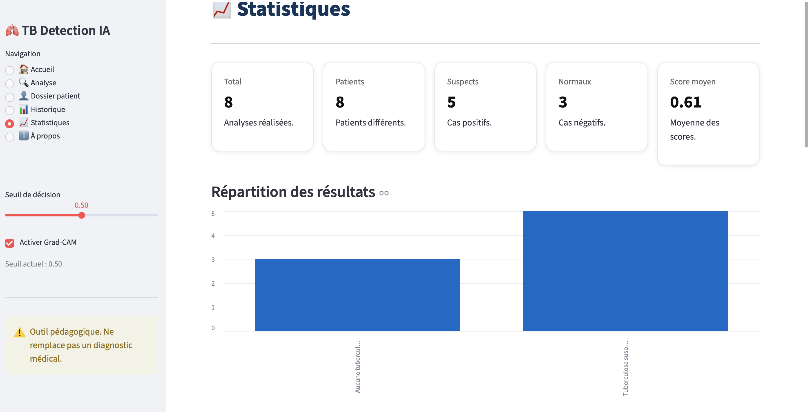
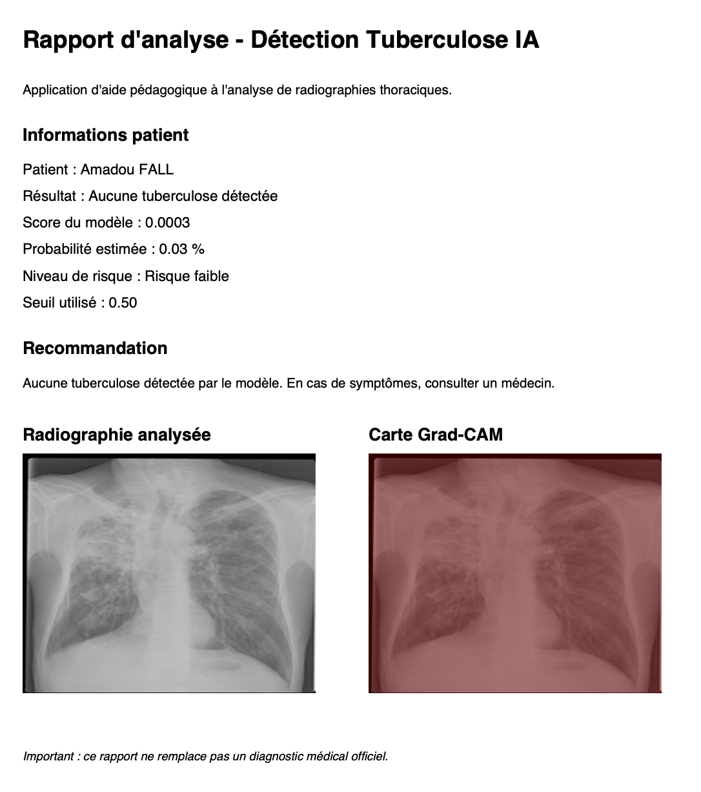

# TB Detection Deep Learning

## Description du projet

Ce projet a pour objectif de développer une solution d'Intelligence Artificielle capable de détecter automatiquement la tuberculose à partir de radiographies pulmonaires.

Le projet est réalisé en plusieurs phases :

- **Phase 1 :** Analyse exploratoire des données (EDA)
- **Phase 2 :** Prétraitement des données
- **Phase 3 :** Entraînement et évaluation de modèles de Deep Learning
- **Phase 4 :** Développement d'une application web interactive permettant l'utilisation du modèle par un utilisateur final.


# Jeu de données

Le jeu de données est composé de :

- **700 radiographies présentant une tuberculose**
- **3500 radiographies normales**

Le déséquilibre des classes est pris en compte lors de l'entraînement du modèle grâce à l'utilisation des **Class Weights**.


# Phase 1 – Analyse exploratoire des données (EDA)

Travaux réalisés :

- Nettoyage du dataset
- Analyse exploratoire (EDA)
- Visualisation des radiographies pulmonaires
- Analyse de la distribution des classes
- Vérification de la qualité des images
- Identification du déséquilibre entre les classes


# Phase 2 – Prétraitement des données

Les opérations suivantes ont été réalisées :

- Chargement des images depuis Google Drive
- Redimensionnement des images en **224 × 224 pixels**
- Conversion des images sous forme de tableaux NumPy
- Normalisation des pixels entre **0 et 1**
- Création des variables **X** et **y**
- Séparation du dataset (80 % entraînement / 20 % test)
- Gestion du déséquilibre des classes avec **Class Weights**


# Phase 3 – Modélisation

Deux architectures ont été développées et comparées.

## CNN classique

- Architecture convolutionnelle personnalisée
- Accuracy : **87 %**

## Transfer Learning – MobileNetV2

Le modèle final repose sur MobileNetV2 pré-entraîné.

Résultats obtenus :

- Accuracy : **94 %**
- Meilleure généralisation
- Meilleure robustesse
- Temps d'entraînement réduit


# Évaluation du modèle

Le modèle a été évalué à l'aide de plusieurs métriques :

- Accuracy
- Precision
- Recall
- F1-Score
- Matrice de confusion
- Courbe ROC (AUC)

Les performances obtenues montrent une excellente capacité du modèle à détecter les cas de tuberculose tout en limitant les faux négatifs, critère particulièrement important dans le domaine médical.


# Phase 4 – Développement de l'application

Une application web complète a été développée avec **Streamlit** afin de permettre l'utilisation du modèle de Deep Learning par un utilisateur final.

## Fonctionnalités développées

### Analyse de radiographies

- Import d'une radiographie pulmonaire
- Prétraitement automatique
- Prédiction de la présence d'une tuberculose
- Affichage du score de confiance


### Visualisation du résultat

- Jauge de risque interactive
- Niveau de risque :
  - Faible
  - Modéré
  - Élevé
- Seuil de décision configurable


### Explication des décisions de l'IA

L'application intègre **Grad-CAM**, permettant de visualiser les zones de la radiographie ayant le plus influencé la décision du modèle.

Cette fonctionnalité améliore considérablement l'interprétabilité du modèle.


### Rapport PDF

Génération automatique d'un rapport contenant :

- Informations du patient
- Résultat de l'analyse
- Score obtenu
- Niveau de risque
- Recommandation
- Radiographie originale
- Carte Grad-CAM


### Gestion des analyses

Les analyses sont automatiquement enregistrées dans une base de données SQLite.

L'application permet :

- Consultation de l'historique
- Recherche par patient
- Statistiques globales
- Export CSV


# Technologies utilisées

## Intelligence Artificielle

- TensorFlow
- Keras
- MobileNetV2
- NumPy
- Scikit-learn

## Développement

- Python
- Streamlit
- SQLite
- OpenCV
- Pillow
- Plotly
- ReportLab
- Pandas

## Visualisation

- Matplotlib
- Seaborn
- Grad-CAM


# Lancement du projet

## Installation

```bash
pip install -r requirements.txt
```

## Exécution

```bash
streamlit run app.py
```

L'application sera accessible depuis :

```
http://localhost:8501
```

# Captures d'écran

## Page d'accueil




## Analyse d'une radiographie




## Résultat de l'analyse




## Visualisation Grad-CAM




## Dossier patient




## Statistiques




## Rapport PDF




# Perspectives d'amélioration

Les évolutions possibles du projet sont :

- Authentification des utilisateurs
- Gestion complète des dossiers patients
- Déploiement sur le Cloud
- Comparaison avec ResNet50, EfficientNet et DenseNet
- Optimisation des performances du modèle
- Validation sur un jeu de données plus important


# Auteur

**Abdoulaye DIOUF**

Projet réalisé dans le cadre du module **Deep Learning**.


# Avertissement

Cette application est destinée à un usage pédagogique et de démonstration.

Elle ne remplace en aucun cas l'avis d'un professionnel de santé ou un diagnostic médical officiel.
